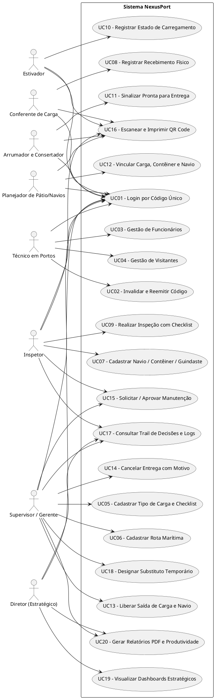

# Diagrama de Casos de Uso (UML) — NexusPort

Este documento apresenta o Diagrama de Casos de Uso do sistema **NexusPort** para automação de carregamentos no porto, cobrindo todos os 9 cargos/perfis de usuários e suas respectivas interações funcionais.

---

## 1. Mapeamento de Atores / Perfis

O sistema contempla 9 cargos organizados em 4 níveis hierárquicos:

### Nível Operacional (Visão Própria / Específica)
1. **Estivador (EST):** Movimentação de cargas no pátio e atualização do estado do carregamento.
2. **Conferente de Carga (CONF):** Registro de recebimento físico de mercadorias e verificação das condições físicas na saída.
3. **Arrumador e Consertador (ARR):** Organização, acondicionamento e sinalização de carga como "pronta para entrega".
4. **Planejador de Pátio e de Navios (PLAN):** Atualização do estado operacional e localização de navios e contêineres.
5. **Técnico em Portos (TEC):** Cadastro de funcionários, documentação interna, leitores e registro de visitantes temporários, além do gerenciamento/reemissão de códigos individuais de acesso.

### Nível Tático (Visão Operacional Ampliada)
6. **Inspetor (INSP):** Inspeção técnica formal com checklist, cadastro inicial de novos navios, contêineres e guindastes, acionamento de alarmes/procedimentos de emergência e acesso total às funções operacionais.

### Nível Gestão (Visão Operacional / Decisões Críticas)
7. **Supervisor / Gerente de Operações (SUP):** Liberação de cargas e navios, aprovação e recusa de manutenções, cancelamento de entregas com motivo, cadastro de rotas e tipos de carga, registro de horário de chegada de navios e delegação de substituto temporário.

### Nível Estratégico (Visão Estratégica)
8. **Diretor de Operações e Logística (DIR-OP)**
9. **Diretor-Presidente / Superintendente (DIR-PRES) / Conselho de Administração (CONS):** Acesso total de leitura, dashboards consolidados com indicadores gráficos, relatórios de produtividade e exportação de dados históricos.

---

## 2. Diagrama de Casos de Uso em Mermaid

```mermaid
graph TD

    %% ATORES
    subgraph Atores["Atores do Sistema"]
        EST["Estivador"]
        CONF["Conferente de Carga"]
        ARR["Arrumador e Consertador"]
        PLAN["Planejador de Pátio e Navios"]
        TEC["Técnico em Portos"]
        INSP["Inspetor"]
        SUP["Supervisor / Gerente de Operações"]
        DIR["Diretor (Estratégico)"]
    end

    %% CASOS DE USO POR MÓDULO
    subgraph Autenticacao["Autenticação e Acesso"]
        UC_Login["UC01 - Efetuar Login via Código Único"]
        UC_TrocaCodigo["UC02 - Reemitir/Invalidar Código de Acesso"]
    end

    subgraph GestaoPessoas["Gestão de Pessoas e Visitantes"]
        UC_CadFunc["UC03 - Cadastrar/Editar Funcionário"]
        UC_CadVisitante["UC04 - Cadastrar Visitante Temporário"]
    end

    subgraph CadastrosBase["Cadastros e Infraestrutura"]
        UC_CadTipoCarga["UC05 - Cadastrar Tipo de Carga e Checklist"]
        UC_CadRota["UC06 - Cadastrar Rota Marítima"]
        UC_CadNavio["UC07 - Cadastrar Novo Navio"]
        UC_CadContainer["UC08 - Cadastrar Novo Contêiner"]
        UC_CadGuindaste["UC09 - Cadastrar Guindaste"]
    end

    subgraph FluxoCarga["Fluxo e Operações de Carga"]
        UC_AgendarCarga["UC10 - Agendar Entrega de Carga"]
        UC_ReceberCarga["UC11 - Registrar Recebimento Físico de Carga"]
        UC_InspecionarCarga["UC12 - Realizar Inspeção Técnica com Checklist"]
        UC_MovimentarCarga["UC13 - Selecionar e Registrar Movimentação no Pátio"]
        UC_ProntaEntrega["UC14 - Alterar Status para Pronta para Entrega"]
        UC_VincularCarga["UC15 - Vincular Carga -> Contêiner -> Navio"]
        UC_LiberarSaida["UC16 - Liberar Saída de Carga/Navio"]
        UC_CancelarEntrega["UC17 - Cancelar Entrega com Motivo"]
    end

    subgraph ManutencaoEmergencia["Manutenção e Emergências"]
        UC_SolicitarManut["UC18 - Solicitar Manutenção de Navio/Guindaste"]
        UC_AprovarManut["UC19 - Aprovar/Recusar Manutenção"]
        UC_RegEstadoNavio["UC20 - Registrar Estado de Reforma/Operação"]
        UC_Emergencia["UC21 - Coordenar Emergências / Acionar Alarmes"]
    end

    subgraph QRCodeEtiquetas["QR Code e Mobilidade"]
        UC_GerarQR["UC22 - Gerar e Imprimir Etiqueta QR Code"]
        UC_EscanearQR["UC23 - Escanear QR Code via Câmera"]
    end

    subgraph AuditoriaDashboards["Auditoria, Dashboards e Relatórios"]
        UC_ConsultarTrail["UC24 - Consultar Trail de Decisões / Retificar"]
        UC_ConsultarLog["UC25 - Consultar Log de Alterações"]
        UC_DelegarSupervisor["UC26 - Designar / Revogar Substituto Temporário"]
        UC_DashOperacional["UC27 - Visualizar Dashboards Operacionais"]
        UC_DashEstrategico["UC28 - Visualizar Dashboards Estratégicos e Gráficos"]
        UC_GerarRelatorioPDF["UC29 - Gerar Relatório PDF A4 de Carga"]
        UC_RelatorioProdutividade["UC30 - Gerar Relatório de Produtividade"]
    end

    %% RELACIONAMENTOS DE ATORES E CASOS DE USO
    EST --> UC_Login
    EST --> UC_MovimentarCarga
    EST --> UC_EscanearQR

    CONF --> UC_Login
    CONF --> UC_ReceberCarga
    CONF --> UC_EscanearQR

    ARR --> UC_Login
    ARR --> UC_ProntaEntrega
    ARR --> UC_EscanearQR

    PLAN --> UC_Login
    PLAN --> UC_VincularCarga
    PLAN --> UC_EscanearQR

    TEC --> UC_Login
    TEC --> UC_TrocaCodigo
    TEC --> UC_CadFunc
    TEC --> UC_CadVisitante

    INSP --> UC_Login
    INSP --> UC_CadNavio
    INSP --> UC_CadContainer
    INSP --> UC_CadGuindaste
    INSP --> UC_InspecionarCarga
    INSP --> UC_RegEstadoNavio
    INSP --> UC_Emergencia
    INSP --> UC_EscanearQR
    INSP --> UC_DashOperacional
    INSP --> UC_ConsultarTrail
    INSP --> UC_RelatorioProdutividade

    SUP --> UC_Login
    SUP --> UC_CadTipoCarga
    SUP --> UC_CadRota
    SUP --> UC_AgendarCarga
    SUP --> UC_LiberarSaida
    SUP --> UC_CancelarEntrega
    SUP --> UC_SolicitarManut
    SUP --> UC_AprovarManut
    SUP --> UC_DelegarSupervisor
    SUP --> UC_DashOperacional
    SUP --> UC_ConsultarTrail
    SUP --> UC_ConsultarLog
    SUP --> UC_GerarRelatorioPDF

    DIR --> UC_Login
    DIR --> UC_DashEstrategico
    DIR --> UC_ConsultarTrail
    DIR --> UC_ConsultarLog
    DIR --> UC_GerarRelatorioPDF
    DIR --> UC_RelatorioProdutividade
```

---

## 3. Diagrama em PlantUML

---

## 4. Matriz de Rastreabilidade (Caso de Uso x Cargo)

| UC | Descrição do Caso de Uso | EST | CONF | ARR | PLAN | TEC | INSP | SUP | DIR |
|---|---|:---:|:---:|:---:|:---:|:---:|:---:|:---:|:---:|
| **UC01** | Efetuar Login por Código Único | X | X | X | X | X | X | X | X |
| **UC02** | Invalidar / Reemitir Código de Acesso | | | | | X | | | |
| **UC03** | Cadastrar e Gerenciar Funcionários | | | | | X | | | |
| **UC04** | Cadastrar Visitantes Temporários | | | | | X | | | |
| **UC05** | Cadastrar Tipo de Carga e Checklist Modelo | | | | | | | X | |
| **UC06** | Cadastrar Rota Marítima | | | | | | | X | |
| **UC07** | Cadastrar Navio, Contêiner e Guindaste | | | | | | X | | |
| **UC08** | Registrar Recebimento Físico de Carga | | X | | | | | | |
| **UC09** | Realizar Inspeção Técnica Formal com Checklist | | | | | | X | | |
| **UC10** | Selecionar e Registrar Movimentação de Carga | X | | | | | | | |
| **UC11** | Alterar Status para "Pronta para Entrega" | | | X | | | | | |
| **UC12** | Atualizar Dados Operacionais e Vinculação | | | | X | | | | |
| **UC13** | Liberar Saída de Carga e Navio | | | | | | | X | |
| **UC14** | Cancelar Entrega com Motivo | | | | | | | X | |
| **UC15** | Solicitar e Aprovar Manutenções | | | | | | X | X | |
| **UC16** | Escanear e Imprimir Etiquetas de QR Code | X | X | X | X | | X | X | |
| **UC17** | Consultar Trail de Decisões e Logs | | | | | | X | X | X |
| **UC18** | Designar / Revogar Substituto Temporário | | | | | | | X | |
| **UC19** | Dashboards Estratégicos com Gráficos | | | | | | | | X |
| **UC20** | Relatório PDF A4 e Relatório de Produtividade | | | | | | X | X | X |
