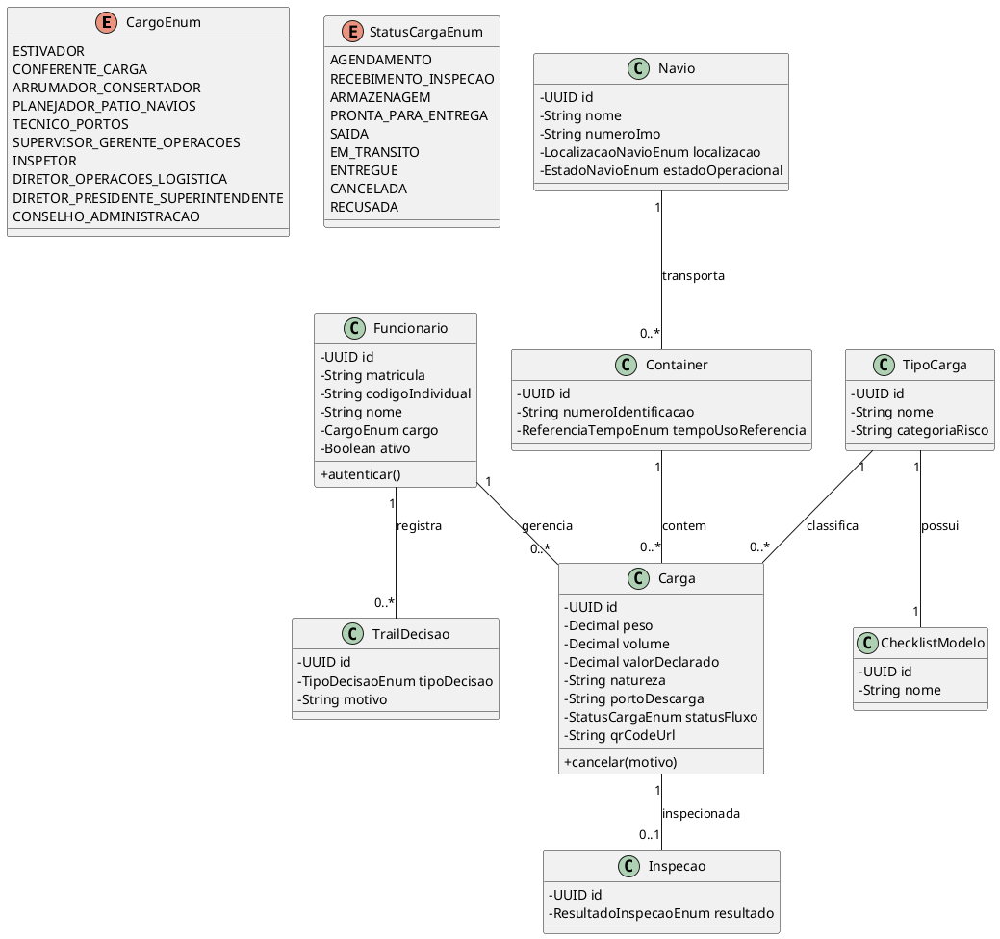

# Diagrama de Classes (UML) — NexusPort

Este documento apresenta o Diagrama de Classes do sistema **NexusPort**, mapeando todas as entidades do domínio portuário, seus atributos, métodos e relacionamentos conforme especificado em `SPECs/Spec.md` e no esquema de banco de dados `SPECs/schema.sql`.

---

## 1. Entidades do Domínio

1. **Funcionario:** Representa os usuários internos do sistema, vinculados por matrícula e código individual único, divididos em 9 cargos.
2. **Visitante:** Pessoas temporárias registradas pelo Técnico em Portos.
3. **TipoCarga:** Categoria da carga com categoria de risco e requisitos especiais.
4. **ChecklistModelo:** Modelo de verificação associado ao Tipo de Carga, criado pelo Supervisor.
5. **ChecklistItem:** Itens específicos do modelo de checklist (críticos e não-críticos).
6. **RotaMaritima:** Rota entre origem e destino com distância fixa em km para cálculo de estimativa de chegada.
7. **Navio:** Embarcação identificada por IMO, coordenadas de localização e estado operacional.
8. **Container:** Caixa metálica padronizada identificada por código, vinculada a navio e tipo de carga.
9. **Guindaste:** Equipamento de movimentação no pátio sujeito a manutenção.
10. **Carga:** Mercadoria com atributos obrigatórios, armazenada em contêiner/navio e acompanhada por checklist e QR Code.
11. **Agendamento:** Registro prévio de chegada de carga ao porto.
12. **Inspecao:** Registro da avaliação física executada pelo Inspetor baseada no modelo de checklist.
13. **InspecaoItem:** Avaliação individual de cada item do checklist durante a inspeção.
14. **Manutencao:** Solicitação/aprovação de manutenção de navio, contêiner ou guindaste.
15. **HistoricoManutencao:** Registro histórico permanente de manutenções realizadas.
16. **LogAlteracao:** Log de auditoria de alterações do sistema (criação, edição, exclusão, reimpressão).
17. **TrailDecisao:** Registro imutável de decisões críticas de alto impacto tomadas por Inspetores e Supervisores.
18. **RetificacaoTrail:** Anexo explicativo vinculado a um registro do Trail de Decisões.
19. **DelegacaoSupervisor:** Designação temporária de substituto com poderes de liberação pelo Supervisor.
20. **LeituraQRCode:** Registro de leitura via câmera de dispositivo móvel.

---

## 2. Diagrama de Classes em Mermaid

```mermaid
classDiagram

    class Funcionario {
        +UUID id
        +String matricula
        +String codigoIndividual
        +String nome
        +CargoEnum cargo
        +String email
        +Boolean ativo
        +autenticar()
        +solicitarNovoCodigo()
    }

    class Visitante {
        +UUID id
        +String nome
        +String documento
        +String motivo
        +DateTime dataHoraEntrada
        +DateTime dataHoraSaida
    }

    class TipoCarga {
        +UUID id
        +String nome
        +String categoriaRisco
        +String requisitosEspeciais
    }

    class ChecklistModelo {
        +UUID id
        +String nome
        +String descricao
        +adicionarItem()
    }

    class ChecklistItem {
        +UUID id
        +String descricao
        +Boolean critico
        +Int ordem
    }

    class RotaMaritima {
        +UUID id
        +String origem
        +String destino
        +Decimal distanciaKm
        +calcularTempoEstimadoHoras(velocidadeKmh)
    }

    class Navio {
        +UUID id
        +String nome
        +String numeroImo
        +Date dataRegistroSistema
        +Int quantidadeCargasRealizadas
        +EstadoNavioEnum estadoOperacional
        +String coordenadasGps
        +Interval tempoForaDoPorto
        +LocalizacaoNavioEnum localizacao
        +String qrCodeUrl
        +atualizarLocalizacao()
        +solicitarManutencao()
    }

    class Container {
        +UUID id
        +String numeroIdentificacao
        +String materialCarregado
        +Date dataFabricacao
        +Date dataUltimaManutencao
        +ReferenciaTempoEnum tempoUsoReferencia
        +EstadoContainerEnum estado
        +String qrCodeUrl
        +calcularTempoUso()
    }

    class Guindaste {
        +UUID id
        +String numeroIdentificacao
        +EstadoGuindasteEnum estado
        +Date dataUltimaManutencao
        +String qrCodeUrl
    }

    class Carga {
        +UUID id
        +Decimal quantidade
        +Decimal peso
        +Decimal volume
        +Decimal valorDeclarado
        +String natureza
        +DateTime dataEntrada
        +DateTime dataSaida
        +String destino
        +String portoDescarga
        +StatusCargaEnum statusFluxo
        +ResultadoInspecaoEnum resultadoInspecao
        +String motivoRecusa
        +String qrCodeUrl
        +gerarEtiquetaPDF()
        +cancelar(motivo)
    }

    class Agendamento {
        +UUID id
        +Date dataPrevistaEntrega
    }

    class Inspecao {
        +UUID id
        +DateTime dataInspecao
        +ResultadoInspecaoEnum resultado
        +String observacoes
        +avaliarItem()
        +concluirInspecao()
    }

    class InspecaoItem {
        +UUID id
        +Boolean conforme
        +String observacao
    }

    class Manutencao {
        +UUID id
        +TipoEntidadeEnum entidadeTipo
        +DateTime dataSolicitacao
        +DateTime dataAprovacao
        +DateTime dataConclusao
        +String descricao
        +StatusManutencaoEnum status
        +aprovar()
        +recusar()
    }

    class HistoricoManutencao {
        +UUID id
        +Date dataManutencao
        +String descricaoServicos
    }

    class LogAlteracao {
        +UUID id
        +DateTime dataHora
        +CargoEnum cargo
        +String codigoIndividual
        +TipoEntidadeEnum entidadeTipo
        +UUID entidadeId
        +TipoAlteracaoEnum tipoAlteracao
        +JSONB detalhes
    }

    class TrailDecisao {
        +UUID id
        +DateTime dataHora
        +CargoEnum cargo
        +String codigoIndividual
        +TipoDecisaoEnum tipoDecisao
        +TipoEntidadeEnum entidadeTipo
        +UUID entidadeId
        +String motivo
        +JSONB detalhes
        +adicionarRetificacao()
    }

    class RetificacaoTrail {
        +UUID id
        +String retificacao
        +DateTime dataHora
    }

    class DelegacaoSupervisor {
        +UUID id
        +DateTime dataInicio
        +DateTime dataFimPrevisto
        +DateTime dataRevogacao
        +Boolean ativo
        +revogar()
    }

    class LeituraQRCode {
        +UUID id
        +TipoEntidadeEnum entidadeTipo
        +UUID entidadeId
        +DateTime dataHora
    }

    %% RELACIONAMENTOS
    Funcionario "1" -- "0..*" Visitante : registra
    Funcionario "1" -- "0..*" ChecklistModelo : cria
    Funcionario "1" -- "0..*" Agendamento : realiza
    Funcionario "1" -- "0..*" Inspecao : realiza
    Funcionario "1" -- "0..*" Manutencao : solicita/aprova
    Funcionario "1" -- "0..*" LogAlteracao : gera
    Funcionario "1" -- "0..*" TrailDecisao : executa
    Funcionario "1" -- "0..*" DelegacaoSupervisor : delega

    TipoCarga "1" -- "1" ChecklistModelo : possui
    ChecklistModelo "1" -- "1..*" ChecklistItem : contem
    TipoCarga "1" -- "0..*" Carga : classifica
    TipoCarga "1" -- "0..*" Container : padroniza

    Navio "1" -- "0..*" Container : transporta
    Container "1" -- "0..*" Carga : contem
    Carga "1" -- "0..1" Agendamento : possui
    Carga "1" -- "0..1" Inspecao : submetida
    Inspecao "1" -- "1..*" InspecaoItem : contem
    ChecklistItem "1" -- "0..*" InspecaoItem : avaliado_em

    Navio "0..1" -- "0..*" Manutencao : sofre
    Container "0..1" -- "0..*" Manutencao : sofre
    Guindaste "0..1" -- "0..*" Manutencao : sofre

    Navio "0..1" -- "0..*" HistoricoManutencao : registra
    Container "0..1" -- "0..*" HistoricoManutencao : registra
    Guindaste "0..1" -- "0..*" HistoricoManutencao : registra

    TrailDecisao "1" -- "0..*" RetificacaoTrail : recebe
    Funcionario "1" -- "0..*" LeituraQRCode : executa
```

---

## 3. Diagrama em PlantUML

