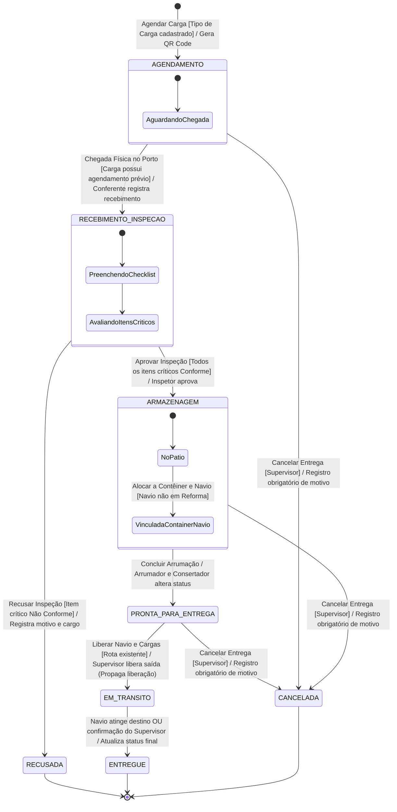
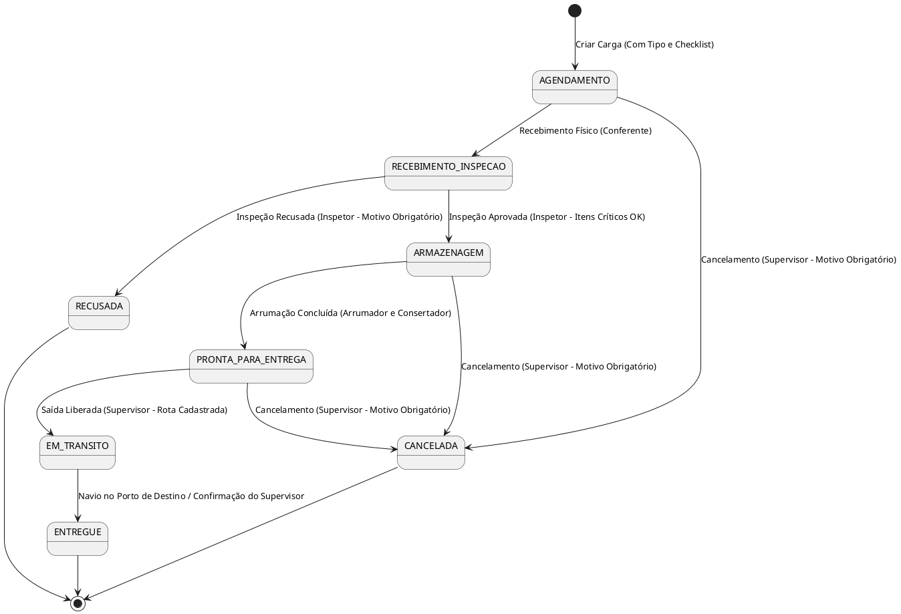

# Diagrama de Estados da Carga (UML State Machine) — NexusPort

Este documento apresenta a Máquina de Estados (UML State Machine) que rege o **Fluxo da Carga** no sistema **NexusPort**, detalhando todos os estados, gatilhos, atores autorizados, guardas de validação e efeitos colaterais das transições, conforme especificado em `SPECs/Spec.md` (Requisito Funcional 6 e Regras de Negócio).

---

## 1. Mapeamento das 8 Etapas do Fluxo + Estados Finais

1. **[Inicio] -> AGENDAMENTO:** Registro prévio da entrega da carga ao porto.
   - *Guarda:* Exige que o Tipo de Carga já esteja cadastrado com o seu Modelo de Checklist correspondente.
2. **RECEBIMENTO_INSPECAO:** Conferente registra o recebimento físico e o Inspetor realiza a inspeção técnica formal com o checklist.
   - *Transição de Aprovação:* Todos os itens críticos do checklist marcados como "Conforme".
   - *Transição de Recusa:* Qualquer falha em item crítico gera o estado **RECUSADA**, registrando data, motivo obrigatoriamente e cargo do Inspetor.
3. **ARMAZENAGEM:** Carga armazenada no pátio (estoque).
4. **VINCULACAO (Ação/Evento de Processo):** Alocação lógica da carga a um contêiner e do contêiner a um navio. Não constitui um estado separado no fluxo da carga.
   - *Guarda:* Navio não pode estar em estado `EM_REFORMA` ou `AGENDADO_PARA_REFORMA`.
5. **PRONTA_PARA_ENTREGA:** Arrumador e Consertador sinaliza que a mercadoria está acondicionada e pronta para embarque.
6. **SAIDA / EM_TRANSITO:** Supervisor libera o navio para saída.
   - *Efeito Colateral:* Liberação automática de todos os contêineres e cargas vinculados.
   - *Guarda:* Rota marítima entre porto de origem e destino deve estar cadastrada (para cálculo da estimativa de chegada a 33 km/h).
7. **ENTREGUE:** Atualização automática quando a localização do navio passa para `NO_PORTO_DE_DESTINO` ou mediante confirmação do Supervisor.
8. **CANCELADA (Estado Final de Exceção):** Supervisor cancela a entrega da carga.
   - *Guarda:* Permitido apenas a partir dos estados `AGENDAMENTO`, `ARMAZENAGEM` ou `PRONTA_PARA_ENTREGA`. Exige justificativa obrigatória.

---

## 2. Diagrama em Mermaid

---

## 3. Diagrama em PlantUML

---

## 4. Tabela de Transições de Estado

| Estado Origem | Evento / Gatilho | Guarda / Condição | Ator Responsável | Estado Destino | Efeitos Colaterais / Ações |
|---|---|---|---|---|---|
| `[*]` | Cadastrar Carga | Tipo de Carga e Checklist modelo cadastrados | Supervisor / Sistema | `AGENDAMENTO` | Gera QR Code único da carga |
| `AGENDAMENTO` | Chegada ao Porto | Possui agendamento prévio | Conferente de Carga | `RECEBIMENTO_INSPECAO` | Registra data/hora, quantidade e estado físico |
| `RECEBIMENTO_INSPECAO` | Aprovação Técnica | Todos os itens críticos do checklist "Conforme" | Inspetor | `ARMAZENAGEM` | Carga alocada ao estoque do pátio |
| `RECEBIMENTO_INSPECAO` | Recusa Técnica | Pelo menos um item crítico "Não Conforme" | Inspetor | `RECUSADA` | Registra data, motivo em texto e cria registro no Trail de Decisões |
| `ARMAZENAGEM` | Acondicionamento | Carga vinculada a contêiner e navio operantes | Arrumador e Consertador | `PRONTA_PARA_ENTREGA` | Atualiza status indicando prontidão para embarque |
| `PRONTA_PARA_ENTREGA` | Liberação do Navio | Rota cadastrada entre origem e destino | Supervisor | `EM_TRANSITO` | Libera automaticamente todos os contêineres e cargas vinculados; calcula ETA a 33km/h; registra no Trail |
| `EM_TRANSITO` | Chegada ao Destino | Navio atinge `NO_PORTO_DE_DESTINO` ou confirmação | Supervisor / Sistema | `ENTREGUE` | Finaliza o fluxo da carga |
| `AGENDAMENTO`, `ARMAZENAGEM`, `PRONTA_PARA_ENTREGA` | Cancelar Entrega | Supervisor fornece justificativa | Supervisor | `CANCELADA` | Registra motivo obrigatório, log e grava decisão imutável no Trail |
