# Modelo Relacional (MER) e Dicionário de Dados — NexusPort

Este documento apresenta a especificação do **Modelo Entidade-Relacionamento (MER)** e o **Dicionário de Dados completo** do banco de dados PostgreSQL/Supabase do sistema **NexusPort**, alinhado a `SPECs/schema.sql` e às regras de negócio de `SPECs/Spec.md`.

---

## 1. Diagrama Entidade-Relacionamento (MER)

```mermaid
erDiagram

    cargo_niveis {
        cargo cargo_enum PK
        nivel nivel_acesso_enum
    }

    funcionarios {
        uuid id PK
        text matricula UK
        text codigo_individual UK
        text nome
        cargo_enum cargo FK
        text email UK
        boolean ativo
        timestamptz created_at
        timestamptz updated_at
    }

    visitantes {
        uuid id PK
        text nome
        text documento
        text motivo
        timestamptz data_hora_entrada
        timestamptz data_hora_saida
        uuid registrado_por FK
    }

    tipos_carga {
        uuid id PK
        text nome UK
        text categoria_risco
        text requisitos_especiais
    }

    checklist_modelos {
        uuid id PK
        uuid tipo_carga_id FK,UK
        text nome
        text descricao
        uuid criado_por FK
    }

    checklist_itens {
        uuid id PK
        uuid checklist_modelo_id FK
        text descricao
        boolean critico
        int ordem
    }

    rotas_maritimas {
        uuid id PK
        text origem
        text destino
        numeric distancia_km
    }

    navios {
        uuid id PK
        text nome
        text numero_imo UK
        date data_registro_sistema
        int quantidade_cargas_realizadas
        estado_navio_enum estado_operacional
        text coordenadas_gps
        interval tempo_fora_do_porto
        text porto_origem
        text porto_destino
        localizacao_navio_enum localizacao
        timestamptz data_chegada
        timestamptz data_saida
        text qr_code_url UK
    }

    containers {
        uuid id PK
        text numero_identificacao UK
        uuid tipo_carga_id FK
        text material_carregado
        date data_fabricacao
        date data_ultima_manutencao
        referencia_tempo_enum tempo_uso_referencia
        estado_container_enum estado
        uuid navio_id FK
        text qr_code_url UK
    }

    guindastes {
        uuid id PK
        text numero_identificacao UK
        estado_guindaste_enum estado
        date data_ultima_manutencao
        text qr_code_url UK
    }

    cargas {
        uuid id PK
        uuid tipo_carga_id FK
        numeric quantidade
        text material
        numeric peso
        numeric volume
        numeric valor_declarado
        text natureza
        timestamptz data_entrada
        timestamptz data_saida
        text destino
        text porto_descarga
        status_carga_enum status_fluxo
        uuid container_id FK
        uuid checklist_modelo_id FK
        resultado_inspecao_enum resultado_inspecao
        text motivo_recusa
        text qr_code_url UK
    }

    agendamentos {
        uuid id PK
        uuid carga_id FK,UK
        date data_prevista_entrega
        uuid agendado_por FK
    }

    estivador_cargas {
        uuid id PK
        uuid estivador_id FK
        uuid carga_id FK
        estado_carregamento_enum estado_carregamento
        timestamptz data_inicio
        timestamptz data_fim
    }

    manutencoes {
        uuid id PK
        tipo_entidade_enum entidade_tipo
        uuid navio_id FK
        uuid container_id FK
        uuid guindaste_id FK
        timestamptz data_solicitacao
        timestamptz data_aprovacao
        timestamptz data_conclusao
        text descricao
        status_manutencao_enum status
        uuid solicitado_por FK
        uuid aprovado_por FK
    }

    historico_manutencoes {
        uuid id PK
        uuid navio_id FK
        uuid container_id FK
        uuid guindaste_id FK
        date data_manutencao
        text descricao_servicos
        uuid registrado_por FK
    }

    inspecoes {
        uuid id PK
        uuid carga_id FK,UK
        uuid checklist_modelo_id FK
        uuid inspetor_id FK
        timestamptz data_inspecao
        resultado_inspecao_enum resultado
        text observacoes
    }

    inspecao_itens {
        uuid id PK
        uuid inspecao_id FK
        uuid checklist_item_id FK
        boolean conforme
        text observacao
    }

    logs_alteracoes {
        uuid id PK
        timestamptz data_hora
        uuid funcionario_id FK
        cargo_enum cargo
        text codigo_individual
        tipo_entidade_enum entidade_tipo
        uuid entidade_id
        tipo_alteracao_enum tipo_alteracao
        jsonb detalhes
    }

    trail_decisoes {
        uuid id PK
        timestamptz data_hora
        uuid funcionario_id FK
        cargo_enum cargo
        text codigo_individual
        tipo_decisao_enum tipo_decisao
        tipo_entidade_enum entidade_tipo
        uuid entidade_id
        text motivo
        jsonb detalhes
    }

    retificacoes_trail {
        uuid id PK
        uuid trail_id FK
        uuid funcionario_id FK
        text retificacao
        timestamptz data_hora
    }

    delegacoes_supervisor {
        uuid id PK
        uuid supervisor_titular_id FK
        uuid substituto_id FK
        timestamptz data_inicio
        timestamptz data_fim_previsto
        timestamptz data_revogacao
        boolean ativo
    }

    leituras_qr_code {
        uuid id PK
        uuid funcionario_id FK
        tipo_entidade_enum entidade_tipo
        uuid entidade_id
        timestamptz data_hora
    }

    %% RELACIONAMENTOS
    funcionarios ||--o{ visitantes : "registra"
    tipos_carga ||--o| checklist_modelos : "possui"
    checklist_modelos ||--|{ checklist_itens : "contem"
    funcionarios ||--o{ checklist_modelos : "cria"
    navios ||--o{ containers : "transporta"
    tipos_carga ||--o{ containers : "padroniza"
    tipos_carga ||--o{ cargas : "classifica"
    containers ||--o{ cargas : "armazena"
    cargas ||--o| agendamentos : "possui"
    funcionarios ||--o{ agendamentos : "agenda"
    funcionarios ||--o{ estivador_cargas : "movimenta"
    cargas ||--o{ estivador_cargas : "submetida"
    cargas ||--o| inspecoes : "inspecionada"
    inspecoes ||--|{ inspecao_itens : "avalia"
    checklist_itens ||--o{ inspecao_itens : "base_para"
    funcionarios ||--o{ inspecoes : "realiza"
    navios ||--o{ manutencoes : "solicita"
    containers ||--o{ manutencoes : "solicita"
    guindastes ||--o{ manutencoes : "solicita"
    funcionarios ||--o{ manutencoes : "solicita_ou_aprova"
    navios ||--o{ historico_manutencoes : "registra"
    containers ||--o{ historico_manutencoes : "registra"
    guindastes ||--o{ historico_manutencoes : "registra"
    funcionarios ||--o{ logs_alteracoes : "gera"
    funcionarios ||--o{ trail_decisoes : "executa"
    trail_decisoes ||--o{ retificacoes_trail : "recebe"
    funcionarios ||--o{ delegacoes_supervisor : "titular_ou_substituto"
    funcionarios ||--o{ leituras_qr_code : "escaneia"
```

---

## 2. Dicionário de Dados Resumido por Tabela

### 2.1. Tabela `funcionarios`
| Coluna | Tipo | Constraint | Descrição |
|---|---|---|---|
| `id` | `UUID` | `PRIMARY KEY` | Identificador único interno |
| `matricula` | `TEXT` | `UNIQUE, NOT NULL` | Matrícula funcional |
| `codigo_individual` | `TEXT` | `UNIQUE, NOT NULL` | Código único de acesso (ex: `NX-8821-SP`) |
| `nome` | `TEXT` | `NOT NULL` | Nome completo do funcionário |
| `cargo` | `cargo_enum` | `NOT NULL` | Cargo exercido (1 dos 9 cargos) |
| `ativo` | `BOOLEAN` | `NOT NULL DEFAULT TRUE` | Status ativo do cadastro |

### 2.2. Tabela `cargas`
| Coluna | Tipo | Constraint | Descrição |
|---|---|---|---|
| `id` | `UUID` | `PRIMARY KEY` | Identificador único |
| `tipo_carga_id` | `UUID` | `FK (tipos_carga.id)` | Vínculo ao tipo de carga |
| `peso` | `NUMERIC(15,3)` | `NOT NULL, CHECK >= 0` | Peso da carga em kg |
| `volume` | `NUMERIC(15,3)` | `NOT NULL, CHECK >= 0` | Volume em m³ |
| `valor_declarado` | `NUMERIC(15,2)` | `NOT NULL, CHECK >= 0` | Valor em R$ |
| `natureza` | `TEXT` | `NOT NULL` | Natureza/característica da mercadoria |
| `porto_descarga` | `TEXT` | `NOT NULL` | Porto específico de desembarque |
| `status_fluxo` | `status_carga_enum`| `NOT NULL` | Status atual do fluxo |
| `container_id` | `UUID` | `FK (containers.id)` | Contêiner associado |
| `qr_code_url` | `TEXT` | `UNIQUE` | URL ou código codificado do QR Code |

### 2.3. Tabela `navios`
| Coluna | Tipo | Constraint | Descrição |
|---|---|---|---|
| `id` | `UUID` | `PRIMARY KEY` | Identificador único do navio |
| `nome` | `TEXT` | `NOT NULL` | Nome oficial da embarcação |
| `numero_imo` | `TEXT` | `UNIQUE, NOT NULL` | Número IMO único |
| `estado_operacional`| `estado_navio_enum`| `NOT NULL` | `OPERANTE`, `EM_REFORMA`, etc. |
| `localizacao` | `localizacao_navio_enum`| `NOT NULL` | `DENTRO_DO_PORTO`, `FORA_DO_PORTO`, etc. |

### 2.4. Tabela `trail_decisoes`
| Coluna | Tipo | Constraint | Descrição |
|---|---|---|---|
| `id` | `UUID` | `PRIMARY KEY` | Identificador imutável |
| `funcionario_id` | `UUID` | `FK (funcionarios.id)` | Autor da decisão |
| `cargo` | `cargo_enum` | `NOT NULL` | Cargo no momento da decisão |
| `tipo_decisao` | `tipo_decisao_enum`| `NOT NULL` | Tipo padronizado de decisão crítica |
| `motivo` | `TEXT` | | Justificativa técnica obrigatoria se exigida |
